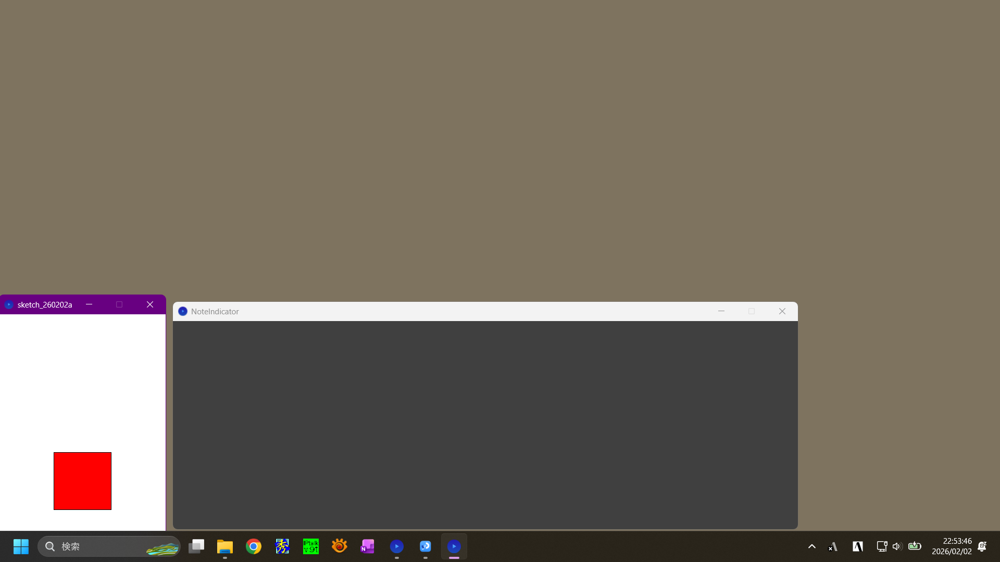

# 画面の一部が赤くなったら通知するツール

要約筆記を行う場合、神奈川県域ではIPtalkを使い、交代の際に[連絡]窓で通知を行います。この際連絡窓のバックグラウンドが赤くなりますが、画面の端なので以外と見落としやすい...ので、

画面のある範囲内である程度以上の数の画素が赤くなったら赤くなるウインドウを作ってみました。

V0.1.0では、とりあえずでっち上げバージョンなので、
画面の左端幅320画素、高さ画面の真ん中辺640画素の範囲で、100x100=10000画素が赤くなったら反応するようにしています。
それぞれの使い方によっていろいろあるでしょうから、
- 検出する範囲
- 反応する色
- 反応する画素数
- ウインドウのサイズ、位置、未反応／反応時の色

あたりは設定できるようにするべきでしょう。

基本動作・未反応時

[基本動作・反応]()
[実用想定動作・未反応]()
[実用想定動作・反応]()